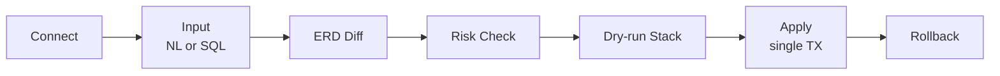

# SQLPreShift

**[한국어](README.md) | English**

A **safety gate** for PostgreSQL schema migrations. Type natural language or SQL, see the schema diff as an ERD, catch risky operations and get safer alternatives, dry-run before you commit, apply in one transaction, and roll back anytime.

<br/>


<br/><br/>

<!-- TODO: capture → assets/hero.gif (full pipeline loop, 8-10s, ERP sample) -->
<p align="center">
  
</p>

<br/><br/>

## Why

Schema migrations are **hard to undo once applied.** The moment an `ALTER` hits a production database, a full-table lock can stall the service, or a change lands exactly as written but not as intended. The trouble is you only find out *after* applying — there's no gate that stops you *before*.

SQLPreShift is that gate. It shows the change as a diff before anything runs, detects risks like locks and full rewrites and proposes safer paths, and lets you accumulate and review changes as a dry-run before committing them in a single transaction.

> Don't regret after applying — stop it before.

It isn't a daily tool for data engineers. It's a **safety gate that blocks dangerous migrations right before they apply.**

<br/><br/>

## Key Features

- **Cumulative dry-run stack + single-transaction apply** — Each change is dry-run against the real database and pushed onto a stack. Review with Undo, then Apply All wraps everything into one transaction. No half-applied, in-between states.
- **18 risk rules + golden-path alternatives** — Detects the operations that trigger lock queues: DELETE/UPDATE without WHERE, DROP, full table rewrites, validating constraints, and more. It doesn't just block — it offers zero-downtime alternatives like `ADD CONSTRAINT ... NOT VALID → VALIDATE`.
- **Size-aware impact** — Risk warnings carry the target table's estimated row count and size, so the same `SET NOT NULL` reads very differently on 100 rows versus 100 million.
- **Read-only integrity diagnostics on connect** — The moment you connect, it runs four read-only checks (broken referential integrity and more). It changes nothing — it just surfaces risk signals in the current state.
- **Local LLM for NL→SQL + RAG** — Natural language is turned into SQL by Ollama (gemma) running on the host, with relevant tables retrieved via schema embeddings (bge-m3 · pgvector). Credentials and inference both stay local — nothing leaves for the cloud.

<br/><br/>

## How it works



Connecting runs the integrity diagnostics immediately. Type natural language or SQL and the schema diff is drawn as an ERD (Split / Unified toggle); when a risk is detected, the impact and a safer alternative appear in a modal. Accumulate changes in the dry-run stack, review, then Apply All in a single transaction — and Rollback if you change your mind.

<br/><br/>

## Quick Start

> **Sample databases included** — Pagila and a 92-table ERP sample boot alongside the app, so you can demo right away without connecting your own database.

**1. Environment**

```bash
cp .env.example .env
```

**2. Ollama** (run on the host — Mac Metal GPU acceleration)

```bash
ollama serve
ollama pull gemma4:latest    # NL→SQL · explanations
ollama pull bge-m3:latest    # RAG embeddings (1024-dim)
```

**3. Start services**

```bash
docker compose up -d
```

- Frontend: http://localhost:3000
- Backend: http://localhost:8000
- Health check: http://localhost:8000/health

The backend runs the meta-DB migration (`alembic upgrade head`) automatically on startup.

<!-- TODO: capture → assets/s1-connect-lobby.png (connection lobby + sample picker) -->
<p align="center">
  
</p>

<br/><br/>

## Architecture

<details>
<summary>Tech stack details</summary>

<br/>

**Backend** — Python · FastAPI 0.115 · SQLAlchemy 2.0 · Alembic · sqlglot 25 · psycopg3 · pgvector

- `sqlglot` parses SQL into an AST to evaluate risk rules deterministically.
- The meta DB (audit_log · migration_history · schema_embeddings) and the runtime-connected target DB are **separated at the engine level**, so a user's migration never pollutes the app's infrastructure DB.
- `pgvector` is used only for cosine search over schema embeddings (RAG).

**Frontend** — Next.js 15 · React 19 · TypeScript · @xyflow/react 12 · dagre · zustand 5 · Monaco · motion 12

- The ERD diff uses `@xyflow/react` + `dagre` auto-layout. Per-change color glow (Diff Bloom) and an Apple HIG-inspired settle motion make changes visible.

**LLM** — Ollama (OpenAI-compatible `/v1/chat/completions`)

- Runs on the host to use the Mac Metal GPU. Containers reach it via `host.docker.internal`.

</details>

<br/><br/>

## API

<details>
<summary>Endpoint overview</summary>

<br/>

| Group | Endpoints |
|-------|-----------|
| `/connection` | `POST /test` · `POST ""` (connect) · `POST /sample` · `GET /status` · `DELETE ""` |
| `/schema` | `GET /graph` · `POST /reindex` |
| `/pipeline` | `POST /analyze` · `POST /apply` · `POST /apply-all` |
| `/audit` | `GET ""` · `POST /{id}/rollback` |

`POST /connection/test` only verifies the connection with `SELECT 1` and changes no state. `POST /connection` verifies, registers the runtime engine, and reindexes the schema.

</details>

<br/><br/>

## Limitations

- **Stateless · one-shot** — User credentials are never persisted to a DB or server (memory only). The connection lives only at runtime.
- **PostgreSQL 16 only** — Other engines such as MySQL are not supported.
- **Portfolio demo** — Not a production service; it exists to demonstrate the concept and visuals of a migration safety gate.
- **Ollama on the host** — NL→SQL and RAG embeddings require a running host Ollama.

<br/><br/>

## License

[MIT](LICENSE)
