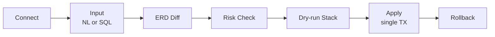

<p align="center">
  
</p>

<!-- 배포 후 아래 홈페이지 URL(href)만 교체하면 됨 -->
<p align="center">
  <a href="https://example.com"></a>
</p>

<p align="center"><a href="README.md">한국어</a> | <b>English</b></p>

A **safety gate** for PostgreSQL schema migrations. Type natural language or SQL, see the schema diff as an ERD, catch risky operations and get safer alternatives, dry-run before you commit, apply in one transaction, and roll back anytime.

<br/>

<p align="center">
  
  
  
  
  
</p>

<br/><br/>

## Why

Schema migrations are **hard to undo once applied.** The moment an `ALTER` hits a production database, a full-table lock can stall the service, or a change lands exactly as written but not as intended. The trouble is you only find out *after* applying, when there's no gate that stops you *before*.

SQLPreShift is that gate. It shows the change as a diff before anything runs, detects risks like locks and full rewrites and proposes safer paths, and lets you accumulate and review changes as a dry-run before committing them in a single transaction.

> Don't regret after applying. Stop it before.

It isn't a daily tool for data engineers. It's a **safety gate that blocks dangerous migrations right before they apply.**

<br/><br/>

## Key Features

- **Cumulative dry-run stack + single-transaction apply**: Each change is dry-run against the real database and pushed onto a stack. Review with Undo, then Apply All wraps everything into one transaction. No half-applied, in-between states.
- **19 risk rules + golden-path alternatives**: Detects the operations that trigger lock queues or touch every row: DELETE/UPDATE without WHERE, constant tautology WHERE, DROP, full table rewrites, validating constraints, and more. It doesn't just block. Most risks come with zero-downtime alternatives like `ADD CONSTRAINT ... NOT VALID → VALIDATE`.
- **Size-aware impact**: Risk warnings carry the target table's estimated row count and size, so the same `SET NOT NULL` reads very differently on 100 rows versus 100 million.
- **Read-only integrity diagnostics on connect**: The moment you connect, it runs five read-only checks (broken referential integrity and more). It changes nothing; it just surfaces risk signals in the current state.
- **Local LLM for NL→SQL + RAG (optional)**: Natural language is turned into SQL by a local Ollama, with relevant tables retrieved via schema embeddings (bge-m3). Credentials and inference both stay local, so nothing leaves for the cloud. Without Ollama you are guided to enter SQL directly, and the core features work without any LLM.

<br/><br/>

## How it works



Connecting runs the integrity diagnostics immediately. Type natural language or SQL and the schema diff is drawn as an ERD (Split / Unified toggle); when a risk is detected, the impact and a safer alternative appear in a modal. Accumulate changes in the dry-run stack, review, then Apply All in a single transaction, and Rollback if you change your mind.

<br/><br/>

## Download

Ships as an installable app for macOS (Apple Silicon). Launch it and the database connection screen appears right away.

1. Grab the latest `SQLPreShift-*.dmg` from [Releases](https://github.com/taehyunan-99/sql-preshift/releases).
2. Open the dmg and drag `SQLPreShift.app` into Applications.
3. **First launch**: the app is not notarized yet, so a plain double-click is blocked by macOS. Open it once with either of these and it runs normally afterward:
   - **Right-click > Open**: then click **Open** again in the warning dialog, or
   - remove the quarantine attribute from a terminal:
     ```bash
     xattr -dr com.apple.quarantine /Applications/SQLPreShift.app
     ```

Connect a database and integrity diagnostics run immediately; enter SQL to use the full diff / risk / dry-run / Apply flow right away.

**Natural-language input (optional)**: NL→SQL and RAG retrieval work only when a local [Ollama](https://ollama.com) is available. Without it you are guided to enter SQL directly, and the core features (connect · diagnose · ERD · risk · dry-run · Apply · Rollback) all work without Ollama. To enable natural language:

```bash
ollama pull gemma4:latest    # NL→SQL · explanations
ollama pull bge-m3:latest    # RAG embeddings (1024-dim)
```

<br/><br/>

## Run from source

```bash
cp .env.example .env
docker compose up -d
```

- Frontend: http://localhost:3000 · Backend: http://localhost:8000 · Health: http://localhost:8000/health
- ERP (92-table) and Pagila demo databases boot alongside. Connect to `localhost:5433` (ERP) etc. from the connection screen to try it out.
- The app's meta DB is a single SQLite file, so no migration step is needed (created automatically on startup).

<br/><br/>

## Architecture

**Backend**: Python · FastAPI 0.115 · SQLAlchemy 2.0 · sqlglot 25 · psycopg3

- `sqlglot` parses SQL into an AST to evaluate risk rules deterministically.
- The meta DB (audit_log · migration_history · schema_embeddings) and the runtime-connected target DB are **separated at the engine level**, so a user's migration never pollutes the app's infrastructure DB. The meta DB is a single SQLite file for the installable app.
- Cosine search over schema embeddings (RAG) runs on BLOB + numpy, with no external vector extension needed.

**Frontend**: Next.js 15 · React 19 · TypeScript · @xyflow/react 12 · dagre · zustand 5 · Monaco · motion 12

- The ERD diff uses `@xyflow/react` + `dagre` auto-layout. Per-change color glow (Diff Bloom) and an Apple HIG-inspired settle motion make changes visible.

**LLM**: Ollama (OpenAI-compatible `/v1/chat/completions`)

- Runs on the host to use the Mac Metal GPU. Containers reach it via `host.docker.internal`.

<br/><br/>

## API

| Group | Endpoints |
|-------|-----------|
| `/connection` | `POST /test` · `POST ""` (connect) · `GET /status` · `DELETE ""` |
| `/schema` | `GET /graph` · `POST /reindex` |
| `/llm` | `GET /status` (NL availability) |
| `/pipeline` | `POST /analyze` · `POST /apply` · `POST /apply-all` |
| `/audit` | `GET ""` · `POST /{id}/rollback` |

`POST /connection/test` only verifies the connection with `SELECT 1` and changes no state. `POST /connection` verifies, registers the runtime engine, and reindexes the schema.

<br/><br/>

## Limitations

- **Stateless · one-shot**: User credentials are never persisted to a DB or server (memory only). The connection lives only at runtime.
- **PostgreSQL 16 only**: Other engines such as MySQL are not supported.
- **Portfolio demo**: Not a production service; it exists to demonstrate the concept and visuals of a migration safety gate.
- **Natural-language input needs Ollama**: only NL→SQL and RAG embeddings depend on a local Ollama. The core features (connect · diagnose · ERD · risk · dry-run · Apply · Rollback) work without it.

<br/><br/>

## License

[MIT](LICENSE)
