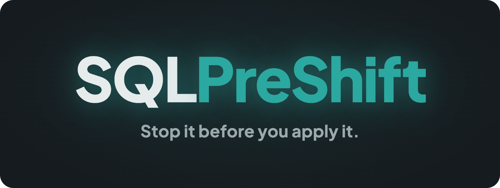
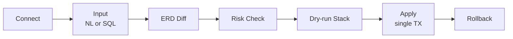

<p align="center">
  
</p>

<!-- 배포 후 아래 홈페이지 URL(href)만 교체하면 됨 -->
<p align="center">
  <a href="https://example.com"></a>
</p>

<p align="center"><b>한국어</b> | <a href="README.en.md">English</a></p>

PostgreSQL 스키마 마이그레이션을 위한 **안전 게이트**. 자연어 또는 SQL을 입력하면 스키마 diff를 ERD로 시각화하고, 위험을 감지해 더 안전한 대안을 제시하며, dry-run으로 미리 돌려본 뒤 승인하면 적용하고 언제든 롤백한다.

<br/>

<p align="center">
  
  
  
  
  
</p>

<br/><br/>

## Why

스키마 마이그레이션은 **적용한 뒤에는 되돌리기 어렵다.** 운영 DB에 `ALTER`를 던지는 순간 테이블 전체가 락에 걸려 서비스가 멈추거나, 의도와 다른 변경이 그대로 박힌다. 정작 위험을 확인할 수 있는 건 적용한 *다음*이다. 적용하기 *전에* 막아주는 게이트가 없다.

SQLPreShift는 그 게이트다. 변경을 실제로 적용하기 전에 diff로 보여주고, 락·전체 재작성 같은 위험을 감지해 더 안전한 경로를 제안하고, dry-run으로 누적해 검토한 뒤에야 단일 트랜잭션으로 적용한다.

> 적용한 뒤에 후회하지 말고, 적용하기 전에 막는다.

데이터 엔지니어의 일상 도구가 아니라, **위험한 마이그레이션을 적용 직전에 차단하는 안전 게이트**를 지향한다.

<br/><br/>

## Key Features

- **누적 dry-run 스택 + 단일 트랜잭션 적용**: 변경을 실제 DB 기준으로 미리 돌려 스택에 쌓고, Undo로 되돌리며 검토한 뒤 Apply All로 한 트랜잭션에 묶어 적용한다. 부분 적용으로 인한 어정쩡한 상태가 없다.
- **위험 룰 19종 + golden path 안전 대안**: DELETE/UPDATE without WHERE, 상수 tautology WHERE, DROP, 전체 테이블 재작성, 검증형 제약 추가 등 락 큐를 유발하거나 전체 행을 건드리는 진짜 위험을 감지한다. 위험을 막기만 하지 않고 대부분의 위험에 `ADD CONSTRAINT ... NOT VALID → VALIDATE` 같은 무중단 대안(golden path)을 함께 제시한다.
- **size-aware 영향 규모**: 위험 경고에 대상 테이블의 추정 행 수·크기를 주입해, 같은 `SET NOT NULL`이라도 100행짜리인지 1억 행짜리인지로 위험을 체감하게 한다.
- **연결 직후 read-only 무결성 진단**: DB에 붙는 즉시 끊어진 참조(broken referential) 등 5항목을 읽기 전용으로 점검한다. 아무것도 변경하지 않고 현재 상태의 위험 신호만 띄운다.
- **로컬 LLM 기반 NL→SQL + RAG (선택)**: 자연어 입력을 로컬 Ollama로 SQL로 변환하고, 스키마 임베딩(bge-m3)으로 관련 테이블을 RAG 검색한다. 자격증명도 추론도 전부 로컬에서 처리되어 클라우드로 나가는 데이터가 없다. Ollama가 없으면 SQL 직접 입력으로 안내되며, 핵심 기능은 LLM 없이 전부 동작한다.

<br/><br/>

## How it works



DB에 연결하면 즉시 무결성 진단이 돈다. 자연어나 SQL을 입력하면 스키마 diff가 ERD로 그려지고(Split / Unified 토글), 위험이 감지되면 영향 규모와 안전 대안을 모달로 띄운다. 변경을 dry-run 스택에 누적해 검토한 뒤 Apply All로 단일 트랜잭션 적용하고, 마음이 바뀌면 Rollback으로 되돌린다.

<br/><br/>

## Download

macOS(Apple Silicon)용 설치형 앱으로 배포한다. 받아서 실행하면 DB 연결 화면이 바로 뜬다.

1. [Releases](https://github.com/taehyunan-99/sql-preshift/releases)에서 최신 `SQLPreShift-*.dmg`를 받는다.
2. dmg를 열어 `SQLPreShift.app`을 Applications로 드래그한다.
3. **첫 실행**: 앱이 아직 공증(notarization) 전이라, 그냥 더블클릭하면 macOS가 차단한다. 다음 중 하나로 한 번만 열면 이후엔 정상 실행된다.
   - **우클릭 > 열기**: 경고 창에서 다시 **열기**를 누른다, 또는
   - 터미널에서 quarantine 속성 제거:
     ```bash
     xattr -dr com.apple.quarantine /Applications/SQLPreShift.app
     ```

DB를 연결하면 즉시 무결성 진단이 돌고, SQL을 입력해 diff/위험/dry-run/Apply 전체 흐름을 바로 쓸 수 있다.

**자연어 입력(선택)**: NL→SQL과 RAG 검색은 로컬 [Ollama](https://ollama.com)가 있을 때만 동작한다. 없으면 SQL 직접 입력으로 안내되며, 핵심 기능(연결·진단·ERD·위험·dry-run·Apply·Rollback)은 Ollama 없이 전부 동작한다. 자연어를 쓰려면:

```bash
ollama pull gemma4:latest    # NL→SQL · 설명 생성
ollama pull bge-m3:latest    # RAG 임베딩 (1024차원)
```

<br/><br/>

## Run from source (개발)

```bash
cp .env.example .env
docker compose up -d
```

- Frontend: http://localhost:3000 · Backend: http://localhost:8000 · Health: http://localhost:8000/health
- ERP(92-table)·Pagila 데모 DB가 함께 기동된다. 연결 화면에서 `localhost:5433`(ERP) 등으로 붙어 바로 시험할 수 있다.
- 앱 메타 DB는 단일 SQLite 파일이라 별도 마이그레이션이 필요 없다(기동 시 자동 생성).

<br/><br/>

## Architecture

**Backend**: Python · FastAPI 0.115 · SQLAlchemy 2.0 · sqlglot 25 · psycopg3

- `sqlglot`로 SQL을 AST로 파싱해 위험 룰을 결정적으로 판정한다.
- 메타 DB(audit_log · migration_history · schema_embeddings)와 런타임 연결되는 사용자 target DB를 **엔진 단위로 분리**해, 사용자 마이그레이션이 앱 인프라 DB를 오염시키지 않게 한다. 메타 DB는 설치형 단일 SQLite 파일이다.
- 스키마 임베딩의 코사인 검색(RAG)은 BLOB+numpy로 처리한다(외부 벡터 확장 불필요).

**Frontend**: Next.js 15 · React 19 · TypeScript · @xyflow/react 12 · dagre · zustand 5 · Monaco · motion 12

- ERD diff는 `@xyflow/react` + `dagre` 자동 레이아웃. 변경 종류별 색광(Diff Bloom)과 Apple HIG 근사 settle 모션으로 변화를 가시화한다.

**LLM**: Ollama (OpenAI 호환 `/v1/chat/completions`)

- 호스트에서 직접 구동해 Mac Metal GPU를 활용한다. 컨테이너는 `host.docker.internal`로 접속한다.

<br/><br/>

## API

| 그룹 | 엔드포인트 |
|------|-----------|
| `/connection` | `POST /test` · `POST ""` (connect) · `GET /status` · `DELETE ""` |
| `/schema` | `GET /graph` · `POST /reindex` |
| `/llm` | `GET /status` (NL 가용성) |
| `/pipeline` | `POST /analyze` · `POST /apply` · `POST /apply-all` |
| `/audit` | `GET ""` · `POST /{id}/rollback` |

`POST /connection/test`는 `SELECT 1`로 연결만 확인하고 상태를 바꾸지 않는다. `POST /connection`은 연결 확인에 더해 런타임 엔진을 등록하고 스키마를 재색인한다.

<br/><br/>

## Limitations

- **stateless · 1회성**: 사용자 자격증명을 DB나 서버에 저장하지 않는다(메모리 전용). 연결은 런타임에만 유지된다.
- **PostgreSQL 16 전용**: MySQL 등 다른 엔진은 지원하지 않는다.
- **포트폴리오 데모**: 실서비스가 아니라 마이그레이션 안전 게이트의 개념과 비주얼을 보여주기 위한 프로젝트다.
- **자연어 입력은 Ollama 필요**: NL→SQL과 RAG 임베딩만 로컬 Ollama에 의존한다. 핵심 기능(연결·진단·ERD·위험·dry-run·Apply·Rollback)은 Ollama 없이 동작한다.

<br/><br/>

## License

[MIT](LICENSE)
